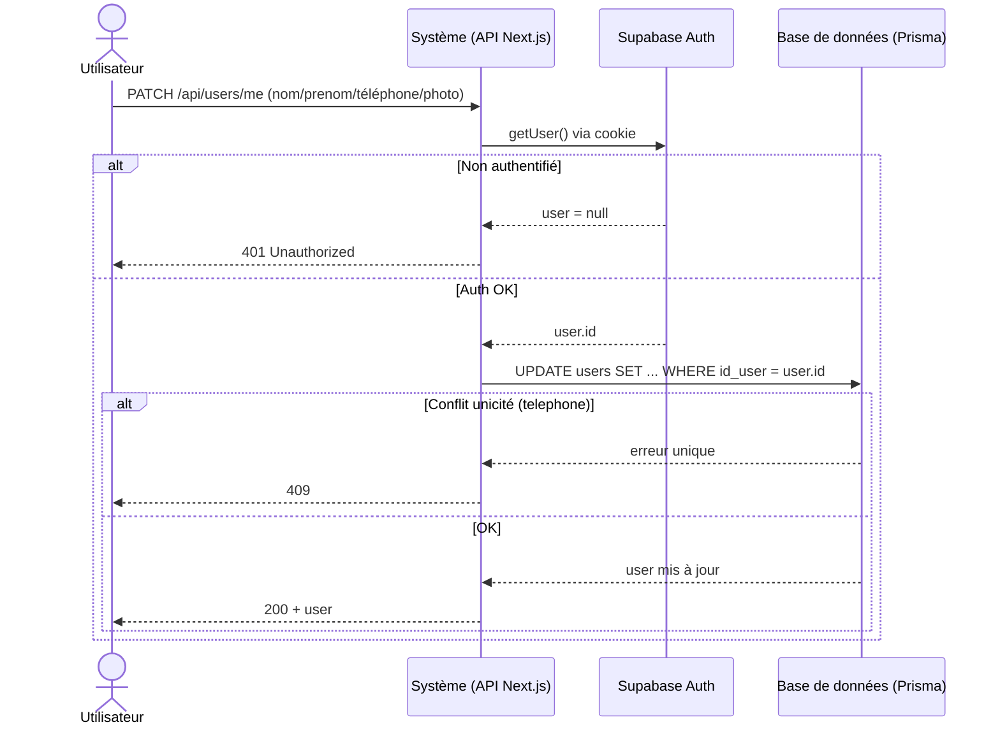

# Mise à jour UML / logique — `PATCH /api/users/me` (profil)

Date : 12 mai 2026

## Objectif
Permettre à l’utilisateur authentifié de modifier ses informations de profil dans la base (Prisma/Postgres) :
- `nom`
- `prenom`
- `telephone`
- `photo_de_profil` (optionnel)

La route est sécurisée par Supabase Auth (cookie de session) et met à jour la table `users` via Prisma.

## Contrat API
### Endpoint
- `PATCH /api/users/me`

### Body JSON (partiel)
```json
{
  "nom": "Dupont",
  "prenom": "Aminata",
  "telephone": "+237690000000",
  "photo_de_profil": "https://..." 
}
```
Champs optionnels. Au moins un champ doit être fourni.

### Réponses
- `200` → `{ ok: true, user: { ... } }`
- `400` → input invalide ou aucun champ à mettre à jour
- `401` → non authentifié
- `404` → user Supabase OK mais pas de ligne correspondante dans `users`
- `409` → conflit d’unicité (ex: `telephone` déjà utilisé)

## Impact sur le schéma Prisma
Aucun changement de schéma requis : la route s’appuie sur le modèle Prisma `User` existant.

Champs impliqués (table `users`) : `nom`, `prenom`, `telephone`, `photo_de_profil`.

## Mise à jour UML (à appliquer)
### 1) Cas d’utilisation
Ajouter/clarifier un cas d’utilisation côté **Utilisateur** :
- « Modifier profil » (inclut : modifier nom / prénom / téléphone / photo)

### 2) Diagramme de séquence (nouveau)
Mermaid (proposition) :


### 3) Diagramme de classes
Aucun ajout de classe. Juste noter que `User` possède/continue de porter :
- `nom`, `prenom`, `telephone`, `photo_de_profil`

## Notes d’implémentation
- Validation Zod centralisée via `updateMeSchema`.
- Normalisation : `nom/prenom` (espaces) et `telephone` (trim + suppression espaces).
- Les décisions d’autorisation se basent sur l’identité Supabase (`auth.getUser()`), pas sur `user_metadata`.
