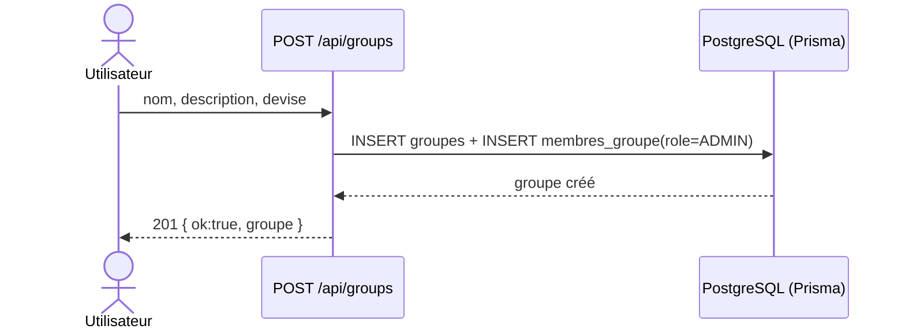
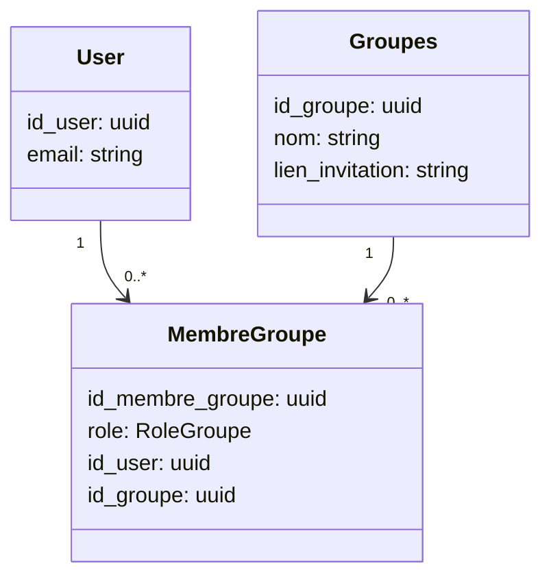

# 2026-05-13 — API Groups (création & liste)

## Objectif
Implémenter:
- `POST /api/groups` — créer un groupe de tontine.
- `GET /api/groups` — afficher tous les groupes d’un utilisateur.

Règle métier principale:
- À la création, l’utilisateur authentifié devient automatiquement **ADMIN** et **membre** du groupe.

## Contrats API

### POST /api/groups
**Auth**: requis (Supabase, cookies)

**Body (JSON)**
- `nom` (string, requis)
- `description` (string, optionnel)
- `devise` (string, optionnel, défaut: `XAF`)

**Réponse 201**
```json
{ "ok": true, "groupe": { "id_groupe": "...", "nom": "...", "lien_invitation": "..." } }
```

**Erreurs**
- 400: entrée invalide
- 401: non authentifié
- 404: utilisateur introuvable en base Prisma

### GET /api/groups
**Auth**: requis

**Réponse 200**
```json
{
  "ok": true,
  "groups": [
    {
      "membership": { "role": "ADMIN" },
      "groupe": { "id_groupe": "...", "nom": "..." }
    }
  ]
}
```

## Schéma Prisma (source de vérité)
Modèles déjà présents et utilisés:
- `Groupes` (`groupes`)
- `MembreGroupe` (`membres_groupe`) avec `role: RoleGroupe` et contrainte unique `@@unique([id_user, id_groupe])`

Aucun changement de schéma requis pour la fonctionnalité "créer un groupe + admin auto".

## Invitation (code unique)
- À la création, le serveur génère `lien_invitation` (unique).
- En cas de collision d’unicité (`P2002`), on retente la génération.

## Mise à jour UML attendue

### Diagramme de séquence (Mermaid)


### Diagramme de classes (Mermaid)

