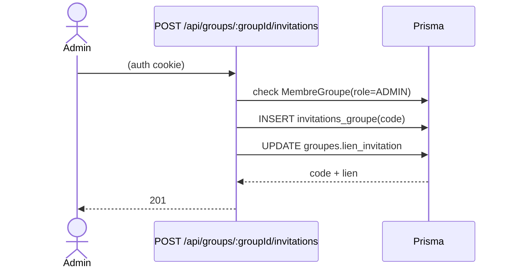
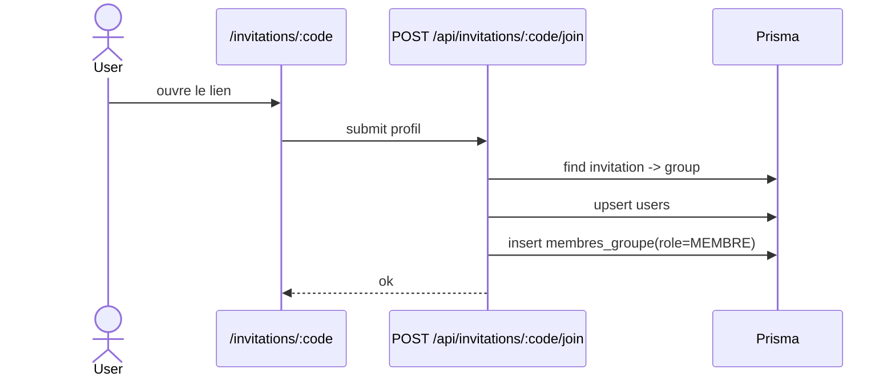

# 2026-05-13 — Invitations, Join & Membres

## Objectif
Ajouter la logique d’invitation pour rejoindre un groupe via un **code/lien unique**, et permettre aux membres d’afficher la liste des autres membres.

Routes:
- `POST /api/groups/:groupId/invitations` — générer un nouveau code/lien d’invitation (ADMIN seulement).
- `POST /api/invitations/:code/join` — rejoindre un groupe via un code.
- `GET /api/groups/:groupId/members` — lister les membres, rôles, statuts.

## Schéma Prisma (priorité)

### Nouvelle table
`InvitationGroupe` (table `invitations_groupe`)
- `code` unique
- liée à `Groupes`
- optionnellement liée à `User` (créateur de l’invitation)
- `date_revocation` pour invalider un code (non utilisé côté API pour le moment, mais prêt)

### Relations
- `Groupes.invitations -> InvitationGroupe[]`
- `User.invitations_creees -> InvitationGroupe[]`

> `Groupes.lien_invitation` est conservé comme "code courant" (pratique pour afficher/partager rapidement), mais les historiques/rotations sont stockés dans `InvitationGroupe`.

## Flux fonctionnel

### Génération d’invitation (ADMIN)
1. Admin appelle `POST /api/groups/:groupId/invitations`
2. Le serveur:
   - vérifie que l’utilisateur est membre du groupe et `role=ADMIN`
   - crée une `InvitationGroupe(code)`
   - met à jour `Groupes.lien_invitation` avec ce code
3. Réponse: code + lien de partage

### Join via code
1. L’utilisateur ouvre `/invitations/:code`
2. S’il n’est pas connecté: UI propose login/register avec `next=/invitations/:code`
3. Une fois connecté, l’utilisateur soumet ses infos (nom, prénom, téléphone, photo) → `POST /api/invitations/:code/join`
4. Le serveur:
   - vérifie l’auth
   - résout le groupe via `InvitationGroupe.code` (fallback via `Groupes.lien_invitation`)
   - upsert le `User` Prisma (selon l’ID Supabase)
  - crée `MembreGroupe` (role `MEMBRE`) dans le groupe
  - si un ancien membre est `INACTIF`, passe le statut à `EN_ATTENTE` et notifie les admins

## UML — Mise à jour attendue

### Séquence (Mermaid)

### Séquence join (Mermaid)

