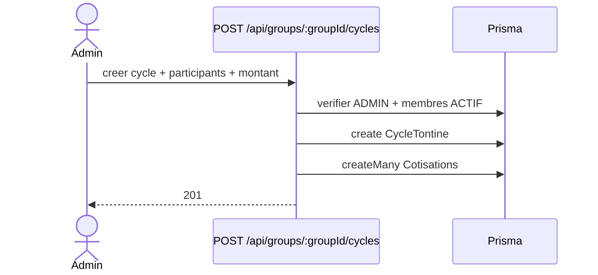

# 2026-05-25 — Cycles de tontine

## Objectif
Permettre a un administrateur de demarrer un cycle de tontine pour un groupe.

## Regles metier
- Seuls les membres `ACTIF` peuvent participer a un cycle.
- Un cycle demarre immediatement a la creation.
- Le montant de cotisation est unique pour tous les participants.

## API
### POST /api/groups/:groupId/cycles
**Auth:** ADMIN du groupe

**Body JSON**
```json
{
  "nom_cycle": "Cycle Mai",
  "duree_tour_de_gain": 30,
  "montant_cotisation": 25000,
  "participants": ["uuid-membre-1", "uuid-membre-2"]
}
```

**Reponses**
- 201: { ok: true, cycle, participants }
- 400: input invalide
- 401: non authentifie
- 403: admin uniquement
- 409: participants invalides ou inactifs

## Stockage
- `CycleTontine` enregistre le cycle (date_debut = maintenant, date_fin calculee).
- `Cotisations` enregistre une cotisation par participant avec le montant fixe.

## UML (mise a jour attendue)
### Sequence (Mermaid)

