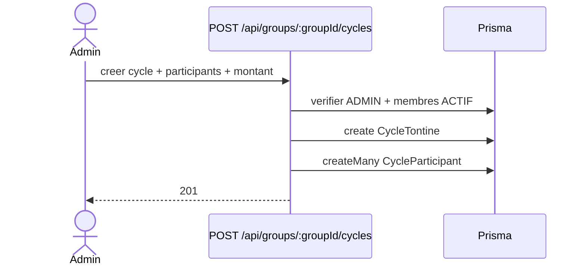

# 2026-05-25 — Cycles de tontine

## Objectif
Permettre a un administrateur de demarrer un cycle de tontine pour un groupe.

## Regles metier
- Seuls les membres `ACTIF` peuvent participer a un cycle.
- Un cycle demarre immediatement a la creation.
- Le montant de cotisation est unique pour tous les participants.
- L'ordre des beneficiaires est defini par l'admin (manuel ou tirage au sort).
- Chaque versement est historise (date + montant).
- Le retard est calcule par tour via la date d'echeance (fin du tour courant).

## API
### POST /api/groups/:groupId/cycles
**Auth:** ADMIN du groupe

**Body JSON**
```json
{
  "nom_cycle": "Cycle Mai",
  "duree_tour_de_gain": 30,
  "montant_cotisation": 25000,
  "participants": ["uuid-membre-1", "uuid-membre-2"]
}
```

**Reponses**
- 201: { ok: true, cycle, participants }
- 400: input invalide
- 401: non authentifie
- 403: admin uniquement
- 409: participants invalides ou inactifs

### GET /api/groups/:groupId/cycles
**Auth:** membre actif du groupe

**Reponses**
- 200: { ok: true, cycles }
- 401: non authentifie
- 403: pas membre actif

### GET /api/groups/:groupId/cycles/:cycleId
**Auth:** membre actif du groupe

**Reponses**
- 200: { ok: true, cycle, payments }
- 401: non authentifie
- 403: pas membre ou pas participant
- 404: cycle introuvable

### PATCH /api/groups/:groupId/cycles/:cycleId
**Auth:** ADMIN du groupe

**Reponses**
- 200: { ok: true, cycle }
- 401: non authentifie
- 403: admin uniquement
- 404: cycle introuvable

### POST /api/groups/:groupId/cycles/:cycleId/payments
**Auth:** ADMIN du groupe

**Body JSON**
```json
{
  "id_membre_groupe": "uuid-membre",
  "montant": 25000,
  "date_paiement": "2026-05-26"
}
```

**Reponses**
- 201: { ok: true, payment }
- 400: input invalide
- 401: non authentifie
- 403: admin uniquement
- 404: cycle introuvable
- 409: membre non actif ou hors cycle

## Stockage
- `CycleTontine` enregistre le cycle (date_debut = maintenant, date_fin calculee, montant fixe).
- `CycleParticipant` stocke les participants et leur ordre.
- `Cotisations` enregistre chaque versement (date + montant) par membre.

## UML (mise a jour attendue)
### Sequence (Mermaid)

