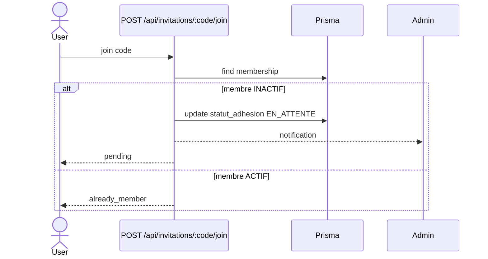

# 2026-05-25 — Exclusion & reintegration des membres

## Objectif
Ajouter un flux de reintegration: un membre exclu peut demander a revenir, mais l'admin doit valider.

## Regles metier
- L'exclusion met `statut_adhesion = INACTIF` et `date_depart = now()`.
- Un membre exclu qui tente de rejoindre a nouveau passe en `EN_ATTENTE`.
- Seul un admin peut valider une demande (`EN_ATTENTE` -> `ACTIF`).
- Un membre exclu ne voit plus le groupe tant qu'il n'est pas `ACTIF`.

## API
### GET /api/groups/:groupId
**Auth:** membre du groupe (actif ou inactif)

**Reponses**
- 200: { ok: true, groupe, membership }
- 401: non authentifie
- 403: pas membre du groupe

### POST /api/invitations/:code/join
- Si membre `ACTIF`: reponse `already_member = true`.
- Si membre `INACTIF`: passe en `EN_ATTENTE` et renvoie `pending = true`.
- Si membre `EN_ATTENTE`: renvoie `pending = true`.

### POST /api/groups/:groupId/rejoin
**Auth:** membre du groupe

**Reponses**
- 200: { ok: true, pending: true }
- 401: non authentifie
- 403: pas membre du groupe
- 409: deja actif

### PATCH /api/groups/:groupId/members/:memberId
**Auth:** ADMIN du groupe

**Body JSON**
```json
{
  "statut_adhesion": "ACTIF"
}
```

**Reponses**
- 200: { ok: true, member: { id_membre_groupe, statut_adhesion } }
- 400: input invalide
- 401: non authentifie
- 403: pas admin ou pas membre
- 404: membre introuvable
- 409: aucune demande en attente

## Notifications
- `MEMBER_REJOIN_REQUEST` -> notifie les admins quand un membre exclu demande a revenir.
- `MEMBER_REJOIN_APPROVED` -> notifie le membre quand la demande est validee.

## UI
- Page membres: bouton "Exclure" seulement.
- Page membres: bouton "Valider" visible si `EN_ATTENTE`.
- Page groupe (fiche): bouton "Demander a reintegrer" si `INACTIF`.

## UML (mise a jour attendue)
### Sequence (Mermaid)

