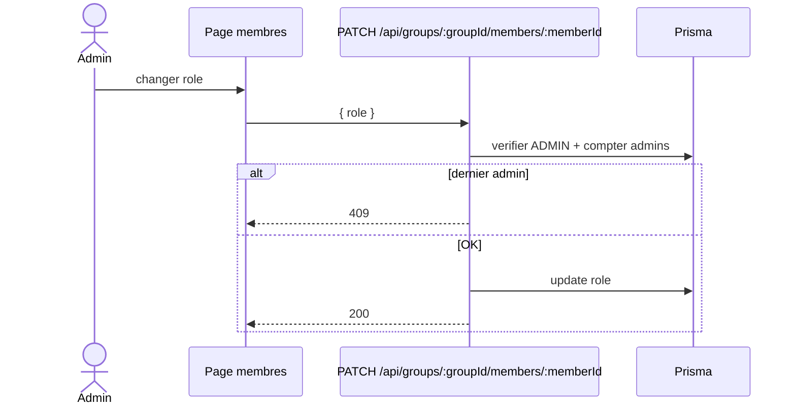

# 2026-05-25 — Roles membres (ADMIN/MEMBRE)

## Objectif
Permettre aux administrateurs d'attribuer un role aux membres d'un groupe.

## Regles metier
- Un groupe doit toujours avoir au moins un administrateur.
- Un administrateur ne peut pas se retirer son propre role.
- Plusieurs administrateurs sont autorises.

## Contrat API
### PATCH /api/groups/:groupId/members/:memberId
**Auth:** ADMIN du groupe

**Body JSON**
```json
{
  "role": "ADMIN"
}
```

**Reponses**
- 200: { ok: true, member: { id_membre_groupe, role } }
- 400: input invalide
- 401: non authentifie
- 403: pas admin ou pas membre
- 404: membre introuvable
- 409: tentative de retirer le dernier admin ou auto-declassement

## Impact Prisma
Aucun changement de schema requis. On met a jour `membres_groupe.role`.

## UI
- Attribution de role depuis la page membres.
- Boutons Admin/Membre visibles pour les administrateurs.
- Auto-declassement bloque cote UI et cote API.
- Badge visible pour ADMIN et MEMBRE.

## Notifications
- Notification in-app envoyee au membre lors du changement de role.

## UML (mise a jour attendue)
### Sequence (Mermaid)

