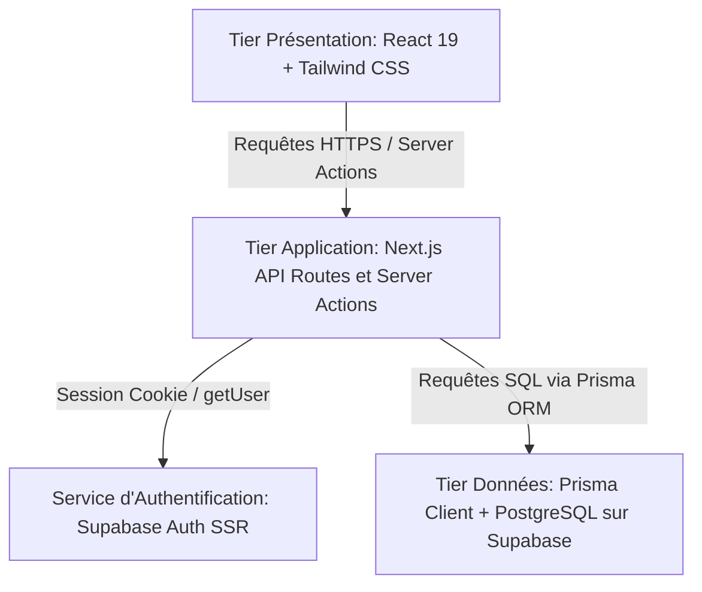

# Analyse Technique et Fonctionnelle du Projet E-Tontine

Ce document présente une analyse approfondie (de fond en comble) du fonctionnement de la plateforme **E-Tontine**, une application web moderne conçue pour digitaliser la gestion des tontines communautaires, sécuriser l'épargne individuelle, structurer le crédit interne (prêts) et assurer la transparence financière grâce à un système comptable robuste.

---

## 1. Introduction et Objectif du Projet

**E-Tontine** répond aux limites des tontines traditionnelles en Afrique subsaharienne (particulièrement au Cameroun) où la gestion manuelle sur carnets papier et tableurs engendre des risques d'erreurs, d'opacité financière, de fraudes et de conflits relationnels. 

L'application centralise et automatise l'ensemble du cycle de vie d'une association tontinière :
*   **Sécurisation** des accès et authentification.
*   **Digitalisation** des cycles de cotisations rotatives (tontine classique).
*   **Autonomie financière** via l'épargne individuelle et le crédit interne (prêts encadrés par des garants).
*   **Gouvernance associative** par le biais de réunions émargées, d'amendes de discipline et de rubriques d'aide mutuelle.
*   **Traçabilité absolue** grâce à un journal financier en double entrée et des caisses dédiées.

---

## 2. Architecture Technique et Stack Technologique

E-Tontine s'appuie sur une architecture 3-tiers moderne et réactive intégrée au framework **Next.js** (App Router) :



*   **Front-end (Tier Présentation)** : Réalisé avec **React** (v19) et **Tailwind CSS**. Il offre une interface responsive (Desktop/Mobile), gère la validation locale avec **react-hook-form** et **Zod**, et offre une expérience fluide grâce à des composants dynamiques.
*   **Back-end (Tier Application)** : S'appuie sur les **API Routes** et **Server Actions** de Next.js. Il centralise les règles métiers, valide rigoureusement les entrées côté serveur avec **Zod**, vérifie les autorisations d'accès, et communique avec les systèmes tiers (SMTP pour les emails, passerelles de paiement).
*   **Persistance (Tier Données)** : Repose sur **Prisma ORM** connecté à une base de données relationnelle **PostgreSQL** hébergée sur **Supabase**. Ce choix garantit l'intégrité transactionnelle (ACID), essentielle pour la comptabilité financière de l'application.
*   **Sécurité et Session** : Gérées via **Supabase Auth SSR** utilisant des cookies sécurisés (`httpOnly`). Les droits d'accès sont vérifiés côté serveur à chaque requête API sensible (réponse `401 Unauthorized` si non authentifié).

---

## 3. Modélisation des Données (Schéma Prisma)

Le schéma Prisma (`prisma/schema.prisma`) constitue la source de vérité pour le modèle logique de données. Il orchestre les entités principales suivantes :

1.  **User** : Représente l'utilisateur global (identifié par son email et numéro de téléphone uniques). Il gère ses informations personnelles et peut appartenir à plusieurs groupes.
2.  **Groupes** : L'association tontinière elle-même. Elle possède sa devise (par défaut le Franc CFA - XAF), ses membres, ses invitations et ses paramètres financiers (ex. règles de prêts).
3.  **MembreGroupe** : Table d'association entre `User` et `Groupes` avec un rôle spécifique (**ADMIN** pour le bureau gérant ou **MEMBRE** pour les adhérents ordinaires). Elle contient également un **statut visuel de discipline (VERT, ORANGE, ROUGE)** calculé selon l'assiduité financière du membre.
4.  **CycleTontine** : Représente une tontine rotative planifiée dans le temps (nom, montant de cotisation fixe, dates de début et fin, ordre de passage des bénéficiaires et règles de pénalités de retard).
5.  **CompteEpargne** : Compte d'épargne individuelle rattaché à un membre au sein d'un groupe. Il stocke le solde actuel et fait l'objet de mouvements (dépôts/retraits).
6.  **Pret** : Demande d'emprunt initiée par un membre. Elle stocke le montant demandé, approuvé, le taux d'intérêt, les échéances de remboursement et le statut (en attente, approuvé, décaissé, remboursé, rejeté).
7.  **AvalistePret** : Table gérant le cautionnement mutuel des prêts. Un membre peut se porter garant d'un emprunteur. L'approbation du garant bloque virtuellement une partie de son épargne.
8.  **Reunion** : Planification des séances physiques/virtuelles (date, type, lieu, montant d'amende standard en cas d'absence) avec suivi des présences dans **PresenceReunion**.
9.  **RubriqueCotisation** : Caisses de secours, de fêtes ou projets spécifiques gérées parallèlement à la tontine rotative principale.
10. **CaisseFinanciere** : Caisses physiques et virtuelles qui subdivisent la trésorerie du groupe par type (Caisse Générale, Caisse du Cycle, Caisse des Amendes, Banque des Prêts, Caisse des Rubriques).
11. **MouvementFinancier** : Trace comptable de chaque transaction financière (entrée ou sortie), avec stockage du **solde avant** et **solde après** pour garantir l'auditabilité et empêcher la falsification des registres.

---

## 4. Analyse Fonctionnelle des Modules (De fond en comble)

### 4.1 Authentification, Sécurité et Profils
*   **Authentification SSR** : Lors de la connexion, le jeton de session est stocké dans les cookies. Le serveur Next.js interroge directement Supabase Auth via ces cookies pour obtenir l'identité de l'utilisateur courant de manière infalsifiable (`supabase.auth.getUser()`).
*   **Validation Zod** : Toutes les entrées (formulaires de connexion, inscription, édition de profil) sont nettoyées et validées côté serveur grâce à Zod pour éviter les injections de données ou les formats de téléphone/emails incohérents.

### 4.2 Groupes, Rôles et Invitations
*   **Adhésion sécurisée** : Un utilisateur ne peut rejoindre un groupe privé que via un code d'invitation unique généré par un Administrateur. Ces codes peuvent être révoqués ou limités dans le temps pour contrôler l'accès.
*   **Contrôle d'accès basé sur les rôles (RBAC)** : Les routes d'API et les Server Actions vérifient systématiquement dans la table `MembreGroupe` si le demandeur possède le rôle `ADMIN` avant d'autoriser des actions d'écriture (création de cycle, validation de prêt, enregistrement de présence).

### 4.3 Cycles de Cotisation (Tontine Rotative)
*   **Algorithme de répartition** : L'administrateur lance un cycle en définissant le montant de cotisation et la périodicité. L'ordre de passage est généré (ou personnalisé) attribuant à chaque membre un "tour de gain".
*   **Cotisations et versements** : À chaque tour, les participants versent leur cotisation (création d'un enregistrement `Cotisations`). Une fois toutes les cotisations du tour collectées, la cagnotte (pot commun) est versée au bénéficiaire désigné via un `Versement` validé par l'administrateur.
*   **Pénalités automatiques** : Si une cotisation n'est pas réglée à la date d'échéance du tour, le système applique une pénalité (taux fixe, pourcentage ou progressif par jour de retard) configurée dans le cycle. Le statut visuel du membre passe à l'Orange ou au Rouge en cas de récidive.
*   **Échange de tours** : Les membres ont la possibilité de négocier un échange de tour de gain (ex. le tour 3 contre le tour 5) via une demande `DemandeEchange` qui requiert l'acceptation de la cible et la validation finale d'un administrateur.

### 4.4 Épargne Individuelle et Sécurisation
*   **Épargne libre** : Les membres disposent d'un compte épargne (`CompteEpargne`) pour y déposer des fonds en dehors des contraintes de la tontine rotative. Les dépôts et retraits font l'objet de transactions strictes (`MouvementEpargne`).
*   **Mécanisme de signalement** : En cas de désaccord sur un mouvement comptable ou une opération d'épargne opérée par un administrateur, le membre peut ouvrir un signalement (`SignalementEpargne`) pour demander un arbitrage et corriger l'écriture.

### 4.5 Gouvernance, Réunions et Discipline
*   **Planification et réunions** : L'administrateur crée une réunion avec une date et un ordre du jour. Les membres peuvent soumettre des demandes d'excuses en cas d'absence.
*   **Émargement et amendes** : Pendant ou après la réunion, l'administrateur enregistre les présences (`StatutPresence` : présent, absent, excusé, en retard). Le système génère automatiquement des amendes financières d'absence ou de retard pour les membres non excusés. Ces amendes sont imputées sur leur épargne ou doivent être payées séparément.

### 4.6 Prêts Internes et Cautionnement Mutuel (Crédit)
Ce module propose un système d'octroi de crédit décentralisé et sécurisé par la communauté :
*   **Demande de prêt** : Un membre éligible saisit un montant de prêt souhaité, une durée de remboursement et un motif.
*   **Système d'avalistes (Caution)** : Pour garantir le remboursement, l'emprunteur désigne des garanties mutuelles (les avalistes). Chaque avaliste doit valider sa participation (`AvalistePret`) en spécifiant le montant qu'il accepte de garantir.
*   **Blocage de garantie** : Lorsqu'un membre accepte d'être avaliste, le système bloque virtuellement un montant correspondant de son propre `CompteEpargne`. En cas de défaut de l'emprunteur, l'administrateur peut opérer une saisie de garantie sur l'épargne de l'avaliste.
*   **Approbation et décaissement** : L'administrateur valide la solvabilité de la demande et l'engagement suffisant des garants, puis approuve le prêt. Les fonds sont décaissés de la caisse "Banque des prêts" vers le membre.
*   **Remboursement** : Le membre effectue ses remboursements périodiques. Le système met à jour le capital et les intérêts restants à chaque versement.

### 4.7 Rubriques Spéciales (Fonds d'Entraide)
*   **Fonds complémentaires** : Permet la collecte de fonds pour des causes de solidarité (fonds de secours, naissances, deuils) ou des projets associatifs spécifiques. Ces rubriques peuvent être obligatoires ou facultatives, temporaires ou récurrentes, et possèdent leur propre caisse d'affectation des fonds.

### 4.8 Comptabilité Centrale, Caisses et Transactions
*   **Journal financier** : Chaque flux financier (cotisation, amende payée, retrait d'épargne, remboursement de prêt) génère un mouvement financier unique (`MouvementFinancier`).
*   **Intégrité transactionnelle** : Pour chaque mouvement comptable, le système enregistre la caisse affectée, le type (entrée ou sortie), le motif, le **solde avant** et le **solde après**. L'opération met à jour le solde courant de la caisse financière (`CaisseFinanciere`) de manière atomique pour éviter tout écart de caisse.
*   **Simulation Mobile Money** : L'application intègre une modale de simulation Mobile Money (MTN MoMo et Orange Money) qui reproduit le comportement d'un push USSD et d'une validation par code secret pour préparer une intégration future aux API réelles de paiement.
*   **Rapports** : Permet l'export des synthèses financières et de l'état de la tontine au format PDF (pour impression et partage) ou Excel (pour audit de tableur).

---

## 5. Flux de Données Typique : Cotisation de Cycle

Le diagramme de flux ci-dessous illustre le parcours de validation d'un versement de cotisation par Mobile Money au sein d'un cycle de tontine :

```
[Membre] --(1. Initie paiement MoMo)--> [Formulaire MobileMoneyCheckout]
                                                    |
                                          (2. Validation Zod)
                                                    |
                                                    v
[Next.js Server Actions] <--(3. Vérification session)-- [Supabase Auth]
         |
  (4. Valide rôle et droits)
         |
         +--(5. Enregistre transaction en attente)--> [PostgreSQL (Prisma)]
         |
  (6. Simule Push USSD MoMo)
         |
[Membre sur Mobile] --(7. Saisie code secret / Succès)--> [Opérateur Externe]
                                                                    |
                                                            (8. Callback API)
                                                                    |
                                                                    v
                                                     [Next.js API Callback]
                                                                    |
                                                     (9. Transaction validée)
                                                                    |
                                                                    v
                                                     [PostgreSQL (Prisma)]
                                                     - Crée Cotisations
                                                     - Crée MouvementFinancier
                                                     - Crédite CaisseFinanciere
                                                                    |
[Membre et Admin] <--(10. Notification succès / Refresh UI)----------+
```

---

## 6. Conclusion

La plateforme **E-Tontine** présente une structure de fonctionnement hautement modulaire et sécurisée. En s'appuyant sur des règles métiers strictes validées côté serveur, une architecture de persistence transactionnelle (ACID) via Prisma/PostgreSQL, et un contrôle d'accès rigoureux via Supabase, elle garantit aux associations tontinières une traçabilité totale et une équité absolue des comptes. 

L'organigramme fonctionnel généré (`Docs/organigramme_fonctionnel.png`) illustre graphiquement cette structuration modulaire et sert de guide visuel pour comprendre l'interconnexion entre ces différents modules d'administration et de gestion.
