# Diagrammes UML actualises - E-Tontine

Date de mise a jour : 08 juin 2026

Ces diagrammes sont alignes sur l'application actuelle : Next.js, Supabase Auth, Prisma/PostgreSQL, groupes, cycles, cotisations, penalites, distributions, rubriques, reunions, epargne, notifications et rapports.

## 1. Cas d'utilisation global

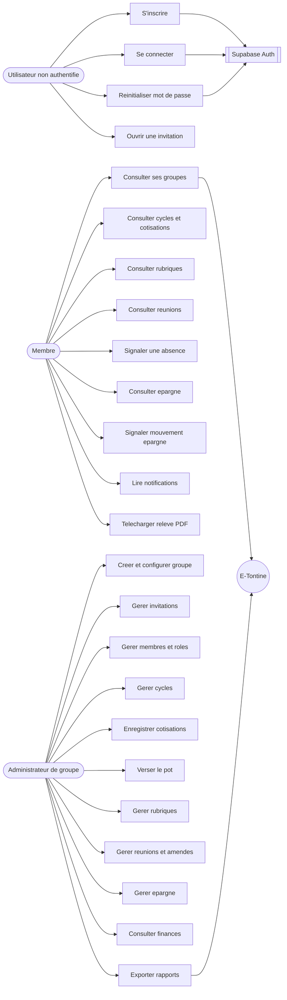

## 2. Cas d'utilisation - Administrateur

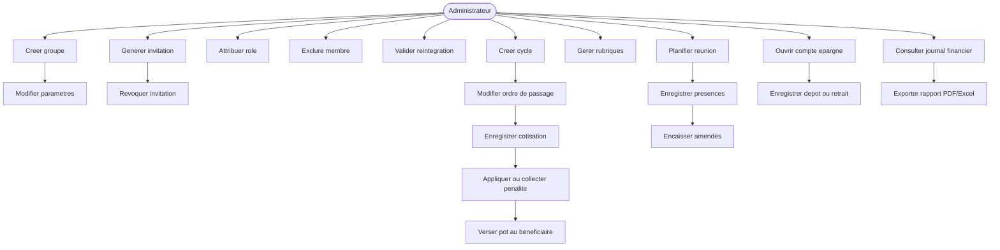

## 3. Cas d'utilisation - Membre

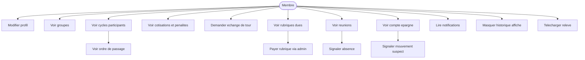

## 4. Activite - Authentification

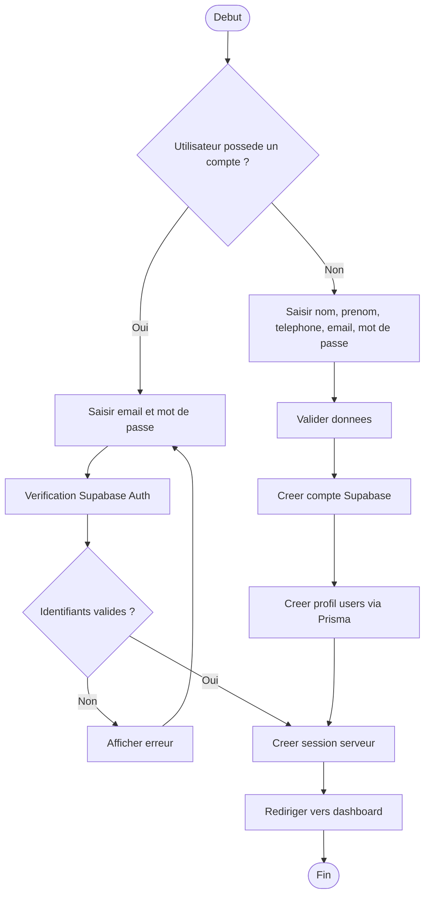

## 5. Activite - Gestion d'un cycle

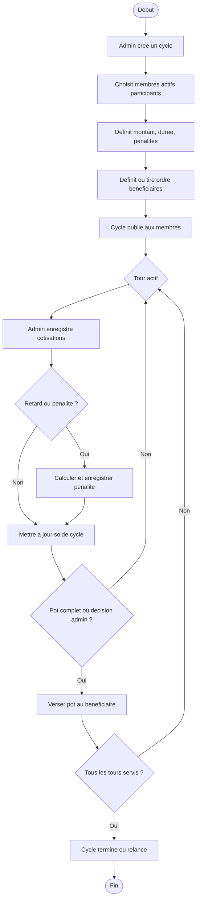

## 6. Sequence - S'authentifier

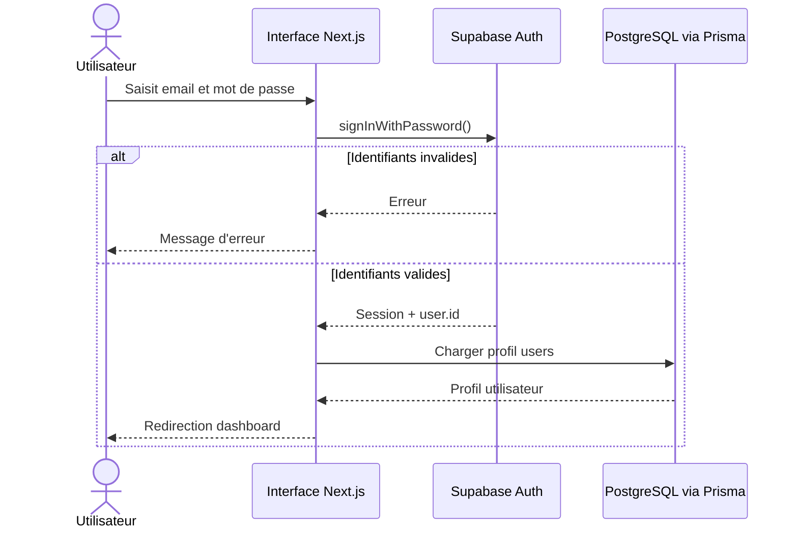

## 7. Sequence - Rejoindre un groupe par invitation

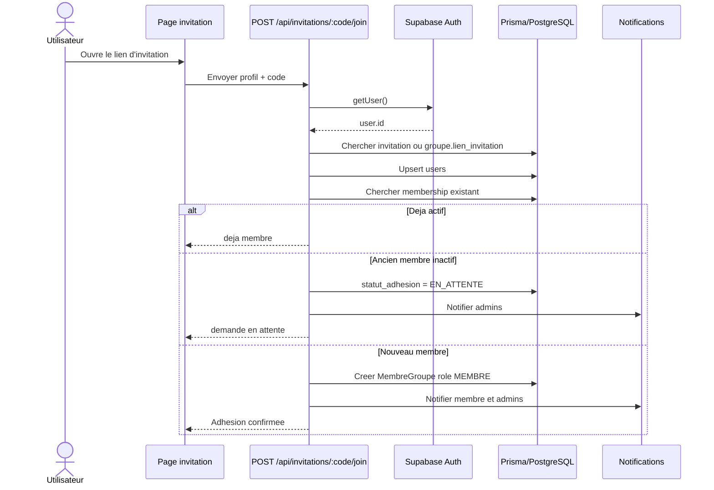

## 8. Sequence - Enregistrer une cotisation

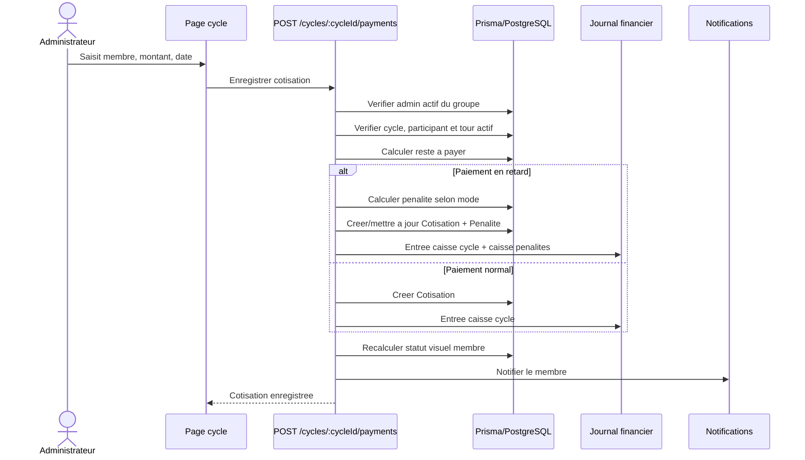

## 9. Sequence - Verser le pot au beneficiaire

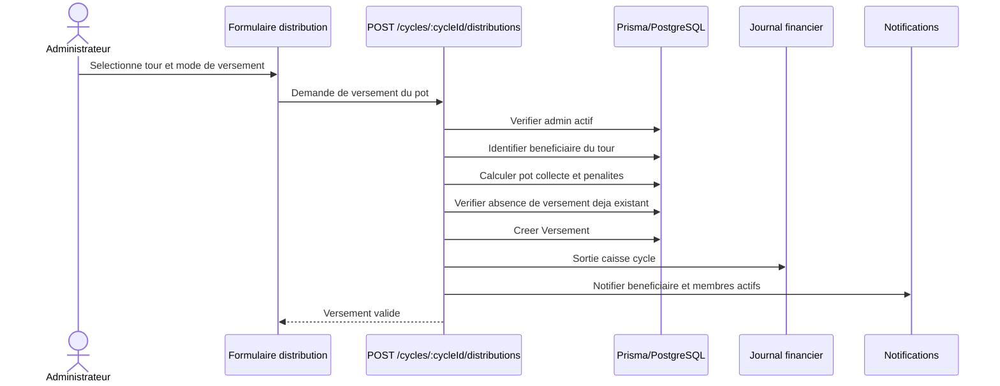

## 10. Sequence - Gerer une reunion et les amendes

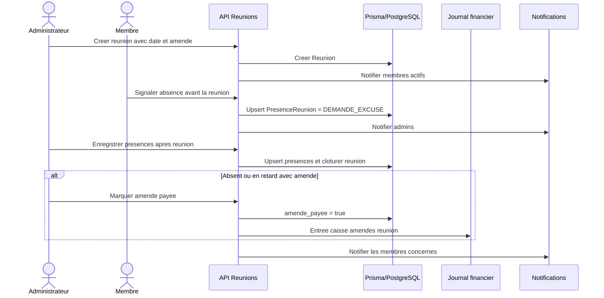

## 11. Sequence - Operation d'epargne

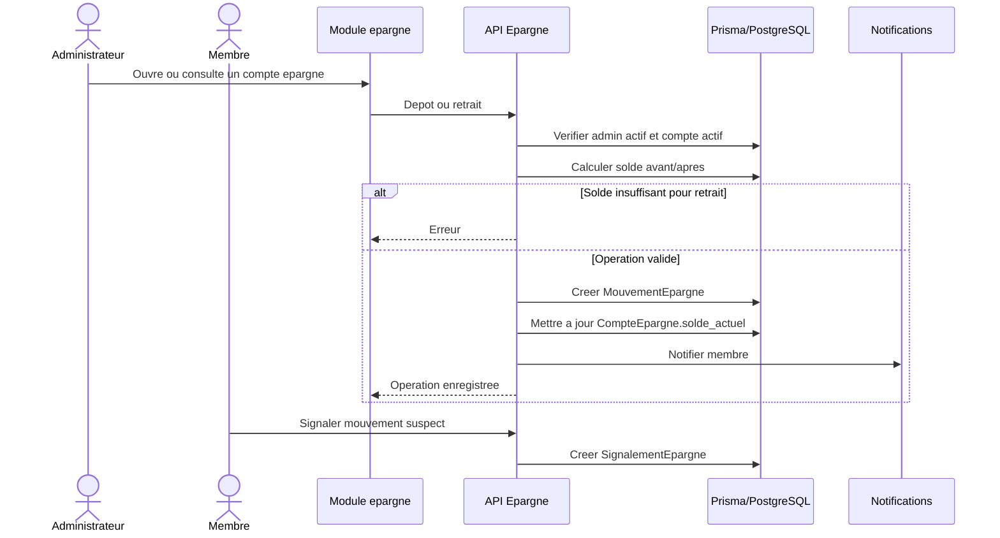

## 12. Diagramme de classes simplifie

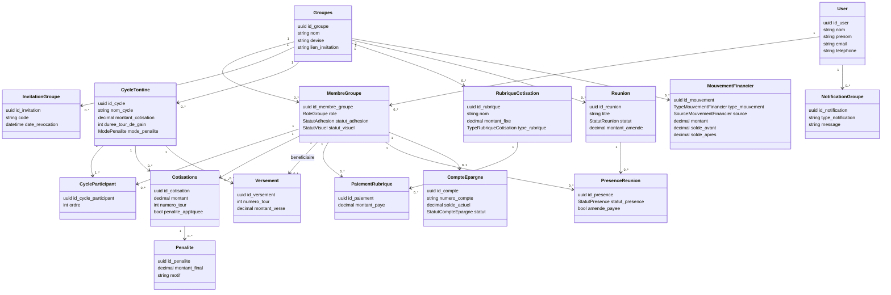

## 13. MCD simplifie

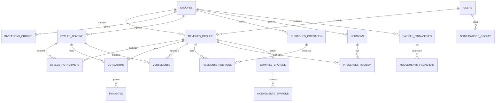

## 14. Architecture applicative

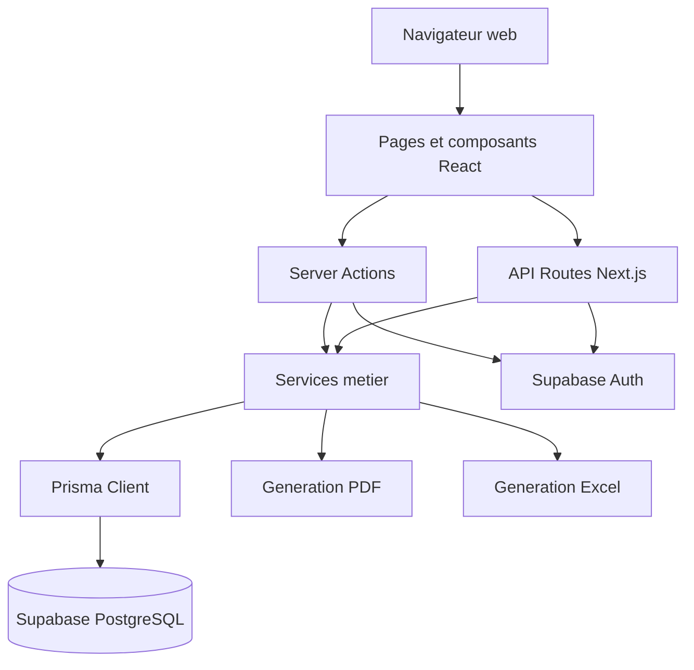

## 15. Diagramme de deploiement

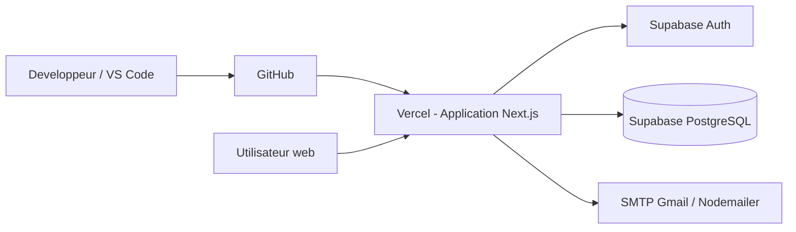

